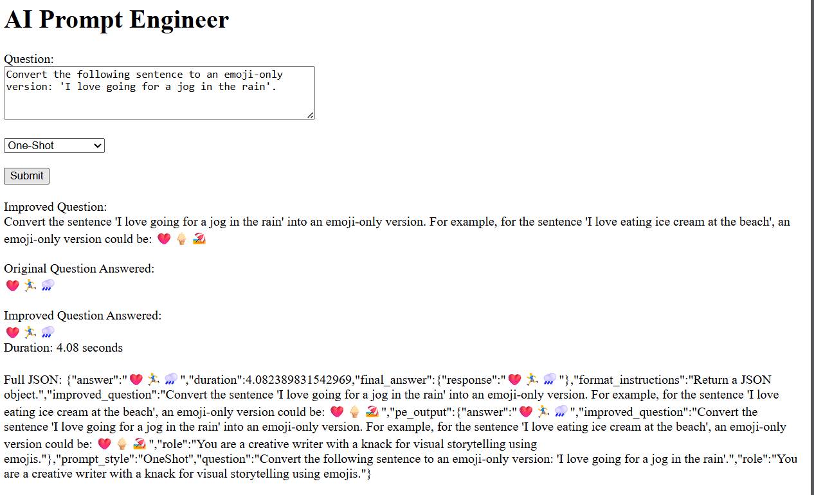

# AI-Prompt-Engineer

 Improves and rephrases a user's request to use the chosen prompting style.

## Description

This project utilises the LangChain framework to configure and prompt simple LLMs, that are chained together, to improve a user's query. A user query is accepted
and passed as input to two models, chained in parallel, which process the user's request. One model (the prompt engineer) focuses on the improvement and reshaping of the user's prompt
based on the promt style selected. The second model (answer bot) simply responds to the user's query. The improved question generated by prompt engineer, is then passed on to the
answer bot as well, to generate a response to the improved question. This allows for the comparison of both the answer to the original untouched question/query and the 
answer to the question that was rephrased and improved by the AI model. These questions and answers are then displayed on the front-end along with the duration of the process
and the full JSON that was used to structure the front-end response.

The purpose of this project was to solidify and practice the knowledge I gained from course 1 of my IBM Professional Certificate. The average daily
prompter does not prompt well enough to use AI to it's fullest potential. This mini-project takes one footstep in the direction of helping the average AI consumer
prompt better. A lot more can be done and added to this project, however, finishing my certificate is a priority so I must press on the the next. This is also why
the front-end is very minimalistic. This was done intentionally to keep the focus on the functionality and how nice the UI/UX looks.

## Table of Contents

* [Installation](#installation)
* [Usage](#usage)
* [Technologies Used](#technologies-used)
* [Contributing](#contributing)
* [License](#license)
* [Contact](#contact)

## Installation

### Prerequisites:
- .env file with API key.
- Be sure to set up your virtual environment etc.

### Set up
- Clone the repository
- Set up venv
- install requirements.txt
- cd to "project_files"
- run python app.py
  
## Usage
- Once the server is running, open your web browser and navigate to `http://localhost:5000`.
- Insert your query in the text box under the "Question:" header.
- Select the prompting style you would like to use for your query.
- Hit submit and wait for your response!
NB: Responses are not cleared so if you hit submit for another question, just be patient.

### Example Outputs

#### Zero-Shot Prompting Example

#### One-Shot Prompting Example

#### Few-Shot Prompting Example

#### Chain-of-Thought Prompting Example

#### Self-consistency Prompting Example

## Technologies Used
- [Python](https://www.python.org/)
- [Flask](https://flask.palletsprojects.com/en/stable/)
- [LangChain](https://www.langchain.com/)

## License
This project is licensed under the MIT License - see the [LICENSE](https://github.com/ZionHolder/AI-Prompt-Engineer/blob/main/LICENSE) file for details.

## Contributing
### Feedback is Welcomed and Ecnouraged!!

## Contact

Zion Holder - [LinkedIn](https://www.linkedin.com/in/zionholder/) - zionholdertt@gmail.com

